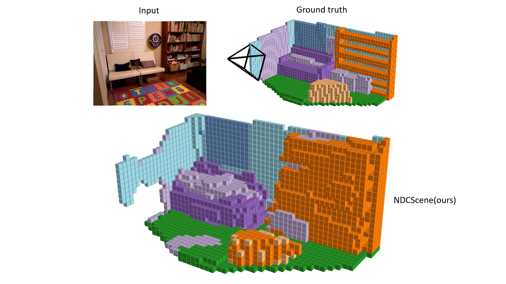

# NDC-Scene: Boost Monocular 3D Semantic Scene Completion in Normalized Device Coordinates Space
Official PyTorch implementation for the ICCV 2023 paper.


**NDC-Scene: Boost Monocular 3D Semantic Scene Completion in Normalized Device Coordinates Space**\
Jiawei Yao*, 
[Chuming Li*](https://scholar.google.com.sg/citations?user=ZfB7vEcAAAAJ&hl=en), 
[Keqiang Sun*](https://keqiangsun.github.io/), 
[Yingjie Cai](https://yjcaimeow.github.io/), 
[Hao Li](https://cpsxhao.github.io/), 
[Wanli Ouyang](https://wlouyang.github.io/), 
[Hongsheng Li](http://www.ee.cuhk.edu.hk/~hsli/) 

\* equal contribution

[](https://jiawei-yao0812.github.io/NDC-Scene/)
[](https://arxiv.org/abs/2309.14616)

[](https://paperswithcode.com/sota/3d-semantic-scene-completion-from-a-single?p=ndc-scene-boost-monocular-3d-semantic-scene)

[](https://paperswithcode.com/sota/3d-semantic-scene-completion-from-a-single-1?p=ndc-scene-boost-monocular-3d-semantic-scene)


|NYUv2 | SemanticKITTI|
|:------------:|:------------:|
|||


## Requirements

1. Create conda environment:

```
$ conda create -y -n ndcscene python=3.7
$ conda activate ndcscene
```
2. This code is compatible with python 3.7, pytorch 1.7.1 and CUDA 10.2. Please install [PyTorch](https://pytorch.org/): 

```
$ conda install pytorch==1.7.1 torchvision==0.8.2 torchaudio==0.7.2 cudatoolkit=10.2 -c pytorch
```

3. Install the additional dependencies:

```
$ cd NDCScene/
$ pip install -r requirements.txt
```

4. Install tbb:

```
$ conda install -c bioconda tbb=2020.2
```

5. Downgrade torchmetrics to 0.6.0
```
$ pip install torchmetrics==0.6.0
```

6. Finally, install NDCScene:

```
$ pip install -e ./
```


## Datasets


### SemanticKITTI

1. You need to download

      - The **Semantic Scene Completion dataset v1.1** (SemanticKITTI voxel data (700 MB)) from [SemanticKITTI website](http://www.semantic-kitti.org/dataset.html#download)
      -  The **KITTI Odometry Benchmark calibration data** (Download odometry data set (calibration files, 1 MB)) and the **RGB images** (Download odometry data set (color, 65 GB)) from [KITTI Odometry website](http://www.cvlibs.net/datasets/kitti/eval_odometry.php).


2. Create a folder to store SemanticKITTI preprocess data at `/path/to/kitti/preprocess/folder`.

3. Store paths in environment variables for faster access (**Note: folder 'dataset' is in /path/to/semantic_kitti**):

```
$ export KITTI_PREPROCESS=/path/to/kitti/preprocess/folder
$ export KITTI_ROOT=/path/to/semantic_kitti 
```

4. Preprocess the data to generate labels at a lower scale, which are used to compute the ground truth relation matrices:

```
$ cd NDCScene/
$ python ndcscene/data/semantic_kitti/preprocess.py kitti_root=$KITTI_ROOT kitti_preprocess_root=$KITTI_PREPROCESS
```

### NYUv2

1. Download the [NYUv2 dataset](https://drive.google.com/file/d/1n8rXSVpWK_Vjcu2P1KKTswBdvEI-U7Uv/view?usp=sharing).

2. Create a folder to store NYUv2 preprocess data at `/path/to/NYU/preprocess/folder`.

3. Store paths in environment variables for faster access:

```
$ export NYU_PREPROCESS=/path/to/NYU/preprocess/folder
$ export NYU_ROOT=/path/to/NYU/depthbin 
```

4. Preprocess the data to generate labels at a lower scale, which are used to compute the ground truth relation matrices:

```
$ cd NDCScene/
$ python ndcscene/data/NYU/preprocess.py NYU_root=$NYU_ROOT NYU_preprocess_root=$NYU_PREPROCESS

```

## Pretrained models

Download NDCScene pretrained models on [NYUv2 & SemanticKITTI](https://drive.google.com/file/d/1hM7oPlJyTM60ZG9wq6qu3f1hUZTVqpRO/view?usp=sharing).

## Training

To train NDCScene with SemanticKITTI, type:

### SemanticKITTI

1. Create folders to store training logs at **/path/to/kitti/logdir**.

2. Store in an environment variable:

```
$ export KITTI_LOG=/path/to/kitti/logdir
```

3. Train NDCScene using 4 GPUs with batch_size of 4 (1 item per GPU) on Semantic KITTI:

```
$ cd NDCScene/
$ python ndcscene/scripts/train_ndcscene.py \
    dataset=kitti \
    enable_log=true \
    kitti_root=$KITTI_ROOT \
    kitti_preprocess_root=$KITTI_PREPROCESS\
    kitti_logdir=$KITTI_LOG \
    n_gpus=4 batch_size=4    
```

### NYUv2

1. Create folders to store training logs at **/path/to/NYU/logdir**.

2. Store in an environment variable:

```
$ export NYU_LOG=/path/to/NYU/logdir
```

3.  Train NDCScene using 2 GPUs with batch_size of 4 (2 item per GPU) on NYUv2:
```
$ cd NDCScene/
$ python ndcscene/scripts/train_ndcscene.py \
    dataset=NYU \
    NYU_root=$NYU_ROOT \
    NYU_preprocess_root=$NYU_PREPROCESS \
    logdir=$NYU_LOG \
    n_gpus=2 batch_size=4

```


## Evaluating 

### SemanticKITTI

To evaluate NDCScene on SemanticKITTI validation set, type:

```
$ cd NDCScene/
$ python ndcscene/scripts/eval_ndcscene.py \
    dataset=kitti \
    kitti_root=$KITTI_ROOT \
    kitti_preprocess_root=$KITTI_PREPROCESS \
    n_gpus=1 batch_size=1
```

### NYUv2

To evaluate NDCScene on NYUv2 test set, type:

```
$ cd NDCScene/
$ python ndcscene/scripts/eval_ndcscene.py \
    dataset=NYU \
    NYU_root=$NYU_ROOT\
    NYU_preprocess_root=$NYU_PREPROCESS \
    n_gpus=1 batch_size=1
```


## Inference

Please create folder **/path/to/ndcscene/output** to store the NDCScene outputs and store in environment variable:

```
export MONOSCENE_OUTPUT=/path/to/ndcscene/output
```

### NYUv2

To generate the predictions on the NYUv2 test set, type:

```
$ cd NDCScene/
$ python ndcscene/scripts/generate_output.py \
    +output_path=$MONOSCENE_OUTPUT \
    dataset=NYU \
    NYU_root=$NYU_ROOT \
    NYU_preprocess_root=$NYU_PREPROCESS \
    n_gpus=1 batch_size=1
```

### Semantic KITTI

To generate the predictions on the Semantic KITTI validation set, type:

```
$ cd NDCScene/
$ python ndcscene/scripts/generate_output.py \
    +output_path=$MONOSCENE_OUTPUT \
    dataset=kitti \
    kitti_root=$KITTI_ROOT \
    kitti_preprocess_root=$KITTI_PREPROCESS \
    n_gpus=1 batch_size=1
```


## Visualization


We use mayavi to visualize the predictions. Please install mayavi following the [official installation instruction](https://docs.enthought.com/mayavi/mayavi/installation.html). Then, use the following commands to visualize the outputs on respective datasets.


You also need to install some packages used by the visualization scripts using the commands:
```
pip install tqdm
pip install omegaconf
pip install hydra-core
```

### NYUv2 

```
$ cd NDCScene/
$ python ndcscene/scripts/visualization/NYU_vis_pred.py +file=/path/to/output/file.pkl
```

### Semantic KITTI 

```
$ cd NDCScene/
$ python ndcscene/scripts/visualization/kitti_vis_pred.py +file=/path/to/output/file.pkl +dataset=kitt
```

## Citation
```
@InProceedings{Yao_2023_ICCV,
    author    = {Yao, Jiawei and Li, Chuming and Sun, Keqiang and Cai, Yingjie and Li, Hao and Ouyang, Wanli and Li, Hongsheng},
    title     = {NDC-Scene: Boost Monocular 3D Semantic Scene Completion in Normalized Device Coordinates Space},
    booktitle = {Proceedings of the IEEE/CVF International Conference on Computer Vision (ICCV)},
    month     = {October},
    year      = {2023},
    pages     = {9455-9465}

}
```

## Acknowledgement
This project is built based on MonoScene. We thank the contributors of the prior project for building such excellent codebase and repo. Please refer to this repo (https://github.com/astra-vision/MonoScene) for more documentations and details.
